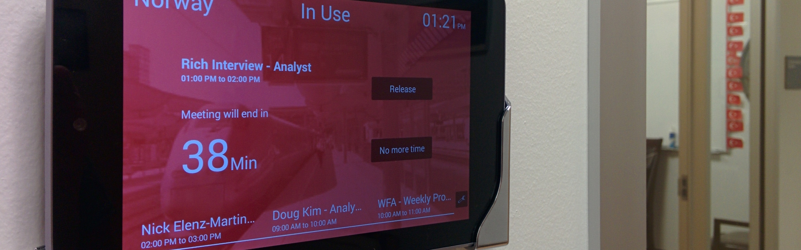

#Bilik



###Use your meeting rooms wisely
No rooms available on your calendar?
But yet you see many rooms underutilized?
 
With Bilik-Pro you will be able to maximize your meeting rooms usage at a very afforable price.

- Why Android?: Android is currently our of the most reliable and affordable options for implementing this type of systems. It provides access to a broad set of hardware options while providing the necessary support Bilik requires.
- Why Google?: Most of our customers are already using Google Apps for Work as their main office backend. Because of that, we decided to provide our functionality to this type of users first.
- Always synced: Our application communicates directly with Google Calendar, synchronizing changes immediately. This means that people operating the tablet and people using the web calendar will always see the same information. No additional servers are required. 

####Visit our website at: www.bilikpro.com
####Or our Facebook: facebook.com/bilikpro

Before compiling this project be sure to follow the instructions:

#Android project:

1. Change the package com.vsc.google.api.services.samples.calendar.android.bilik to something of your own (make up a unique name that has never been used before by anyone)
2. Visit the Google Cloud console flow for the Google Calendar API.
* If necessary, sign in to your Google Account, select or create a project, and agree to the terms of service. Click Continue.
* For Platform select "Android".
	* For "Package name" you should use the one created in the step 1), DIFERENT FROM "com.vsc.google.api.services.samples.calendar.android.bilik".
		> Note: Make sure to pick a legal Java package name since we will be using it in the Android project source code. The full package name must have at least two parts, so for example "janedoe20130911" will not work.
		> Note: If you try to register a package name that has already been registered, you may get an error reading "An unexpected error has occurred." In particular, "com.google.api.services.samples.calendar.android" has already been registered, so you must change the package name.
	* For "SHA1 fingerprint", use the value that is output when running this command in a Terminal:
		```
		keytool -exportcert -alias androiddebugkey -keystore ~/.android/debug.keystore | openssl sha1
		```
		* When asked, use "android" (without the quotes) as the keystore password.
		* Click Register.
	* Click on "APIs" under "APIs & auth" in the left sidebar and make sure "Calendar API" is enabled.

	For more information read http://samples.google-api-java-client.googlecode.com/hg/calendar-android-sample/instructions.html

3. Change the credentials for Parse integration: We use parse.com to store information that is shared for all your tablets.
	1 Create an account and a project called Bilik in parse.com
	2 Edit the assets/config.properties file and include the parseApplicationId and the parseClientKey values provided by parse for your project (Keys menu).
4. Change the credentials for Google Analytics integration: We use google analytics to measure the use of Bilik.
	1 Create a google analytics account and a project called Bilik
	2 Get a tracking Id for your project inside google analytics and add this to the ga_trackingId property of the res/values/analytics.xml file.
5. Change the credentials for Crashlytics integration:
	1 Create a Crashlytics account in www.crashlytics.com
	2 Include the apiKey provided by crashlitics for your account into the AndroidManifest.xml file (property com.crashlytics.ApiKey).

# Server:

1. Update “server/cloud/config.js” with the OAut2 token and secret from Google (to enable authentication with Google Accounts):

	module.exports = {
   		TOKEN_SECRET: '....',
   		GOOGLE_SECRET: '....'		
	};

2. Update “server/cloud/main.js” with the Mailgun account token (in order to allow the server to send periodic updates of the app):

	Mailgun.initialize('...', '...');

#License

    BilikPro	

    Licensed under the Apache License, Version 2.0 (the "License");
    you may not use this file except in compliance with the License.
    You may obtain a copy of the License at

       http://www.apache.org/licenses/LICENSE-2.0

    Unless required by applicable law or agreed to in writing, software
    distributed under the License is distributed on an "AS IS" BASIS,
    WITHOUT WARRANTIES OR CONDITIONS OF ANY KIND, either express or implied.
    See the License for the specific language governing permissions and
    limitations under the License.

Have fun :)
